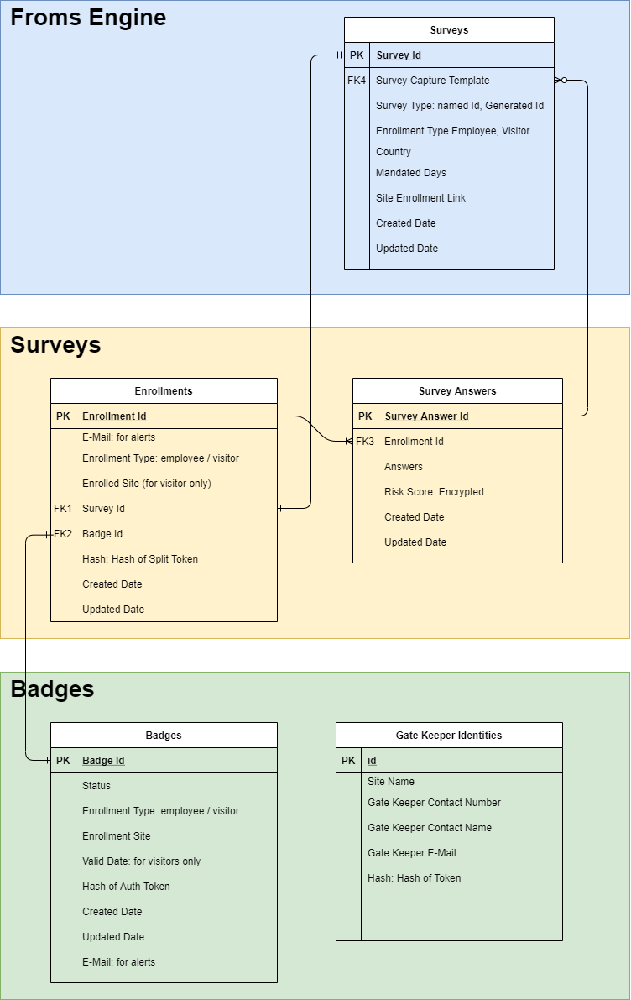

# Workflows - Data Model
## Logical Data Model

Edit diagram by importing it to  https://app.diagrams.net

## 

* Surveys for Sites are loaded in **Surveys**
* Enrollments to surveys by people (employee / visitor) are in **Enrollments**
* Daily survey is captured in **Survey Answers**
* **Badges** has badges issued and their status
* Gate Keeper secret configurations in **Gate Keeper Identities** used by Badges to authroize gate keepers
* **Badges.Hash** produced by people to view badge (as split-token in badge URL)

## Templates
1. Following Templates shall be configurable though dashboard:
* E-Mail Notifications (such as, notifications for joining surveys, receiving badges, alert on revocation, receiving survey links)
* Message of the day (MOTD) displayed on completion of the survey
* Privacy Statement
2. Standard notification templates shall be pre-loaded as a post-deployment step from source code repositories using dashboard API to AWS SES / Email Templates. (_to be implemented_)
3. Standard MOTD and privacy statement shall reside as static web content in [surveys](https://github.dxc.com/soteria/surveys) code repository.

## Privacy

1. Data captured in **Survey Answers**.**Answers** doesn't live beyond transaction life
2. **Survey Answers.Risk Score** is encrypted at rest
3. Time to live for **Survey Answers** is configurable
4. Delete Employee / Visitor Data shall delete Enrollment and Survey Answers (_to be implemented_)

## Logical / Physical Data Model Mapping

|Logical Entity Name|Physical Entity Name|
|--|--|
|Surveys|[forms](https://github.dxc.com/soteria/forms/blob/sandbox/docs/design.md#table-forms)|
|Badges|[requests](https://github.dxc.com/soteria/badges/blob/sandbox/docs/design.md#table-requests)|
|Gate Keeper Identities|[sites](https://github.dxc.com/soteria/badges/blob/sandbox/docs/design.md#table-sites)|
|Enrollments|[userprofiles](https://github.dxc.com/soteria/surveys/blob/sandbox/docs/design.md#table-userprofiles)|
|Survey Answers|[healthprofiles](https://github.dxc.com/soteria/surveys/blob/sandbox/docs/design.md#table-healthprofiles)|
