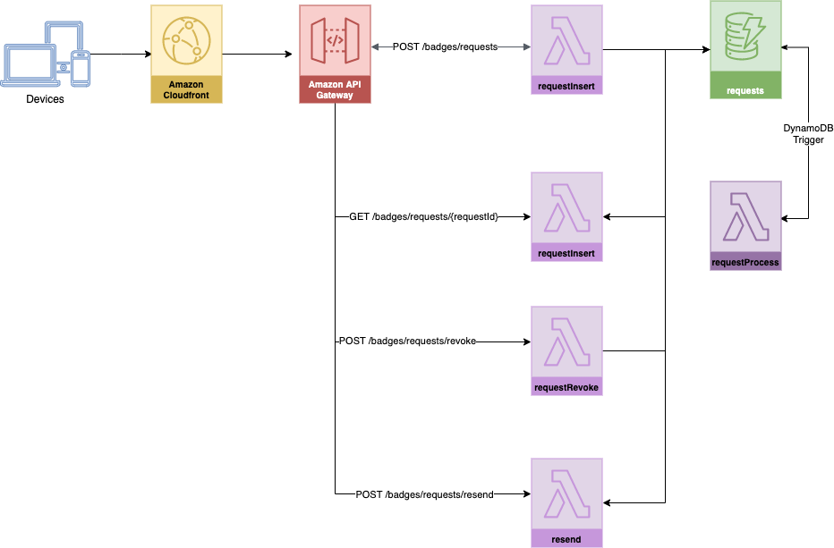

# Design

Edit diagram by importing diagram to  https://app.diagrams.net/



## Table requests

|Name|Values|Description|
|--|--|--|
|requestId|Unique Request ID| - **Primary Key**<br/>- Slug ID is generated on insert|
|name|-|not populated, not used|
|email|E-Mail ID of the employee / visitor||
|passLocation|Location for which the pass is issued to the _visitor_|- The business location to which the pass is requested for<br/>- E.g. RGA Tech Park, Electronic City<br/>- Not used for employee pass|
|passType|enum: _employee_, _visitor_||
|validDate|Valid Date|Required for _visitor_ pass only|
|employeeNumber|-|not populated, not used|
|hashedToken|hased value of secret token||
|status|enum: _pending_, _rejected_, _approved_ |Status of Request|
|createdDate|create date|time in seconds since epoch|
|updatedDate|updated date|time in seconds since epoch|

## Table sites

|Name|Values|Description|
|--|--|--|
|locationId|slug Id|location ID of the site|
|contactNumber|contact number of the contact staff||
|contactName|name|Name of the contact staff||
|email|E-Mail ID|e-mail ID of the contact staff|


## Technology

| Concern | Technology|Description|
|--|--|--|
|Web UI|React, CloudFront|Progressive Web App|
|API|AWS Gateway|Open API Spec|
|Business Logic|NodeJS|AWS Lambdas, DynamodB Triggers|
|Coded Deployment|AWS Code Pipeline, AWS Code Build, AWS Cloud Formation|
|DevOps|Jenkins, Dockerfile|

## UI Screens

### Show Pass: /badges/{requestId}

Pass to show:

1) Project Soteria Logo
4) QR Code

### Sample Employee Pass


### Sample Visitor Pass


## API calls

### POST /badges/requests

Sample inputs to POST

#### Sample Employee Pass Request

```json
{
    "email":            "jdoe@example.com",
    "passType":         "employee",
}
```

#### Sample Visitor Pass Request

```json
{
    "email":            "jdoe@acme.com",
    "passLocation":     "RGA Tech Park",
    "passType":         "visitor",
}
```

### GET /badges/requests/{requestId}

Sample outputs from GET

#### Sample Response for Employee Pass


```json
{
    "requestId":        "xxx-A",
    "email":            "jdoe@example.com",
    "passType":         "employee",
    "status":           "approved",
}
```

#### Sample Response for Visitor Pass

```json
{
    "requestId":        "xxx-A",
    "email":            "jdoe@acme.com",
    "validDate":        "2020/09/30",
    "passLocation":     "RGA Tech Park",
    "passType":         "visitor",
    "status":           "approved",
    "status":           "approved",
}
```

### POST /badges/requests/revoke

Revoke pass

#### Sample Request for revoking pass

```json
{
    "passId": "xxx",
    "revokeReason": "You missed reporting your daily Survey"
}
```

#### Sample Response for revoking pass

```json
 {
    "statusCode": 200,
    "message": "Operation successful"
}
```

### POST /badges/requests/resend

Re-send e-mail link of the badge to visitor

#### Sample Request for resend

```json
{
    "email": "jdoe@acme.com",
    "location": "MEPZ",
    "validDate": "2020/05/19"
}
```

#### Sample Response for resend

API returns Success OK

## Serverless Components

### requestInsert

1. Add Request to requests table with status set to 'Pending'

### requestGet

1. response = requests.GET(requestId)
2. response.pass = base64Encoded(passUrl)
3. return response

### requestProcess

This component shall be triggered on insert to requests table (DynamoDB Trigger)

1. passUrl = POST Identity API
2. Update Request with (passUrl, status = approved)
3. E-Mail Web URL of the pass: e.g. https://{hostName}/badges/{requestId}#secretToken.  This link will take pass web UI

### requestRevoke

Revoke request

### getToken

Get Token for the location

### resend

Send e-mail notification to the visitor with visitor badge

#### Sample QR Code Content for Employee

https://{hostName}/l/{badgeId}

#### Sample QR Code Content for Visitor

https://{hostName}/l/{badgeId}
